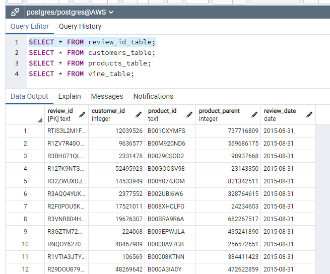
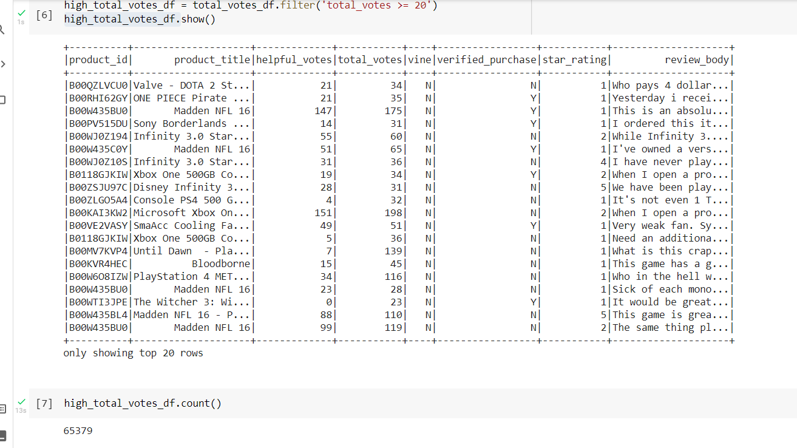

# Amazon_Vine_Analysis

# High-level Overview
The purpose of this project was to analyze Amazon reviews written by members of the paid Amazon Vine program.  Specifically to distinguish if there can be bias toward favorable reviews of video game products or bias toward paid vs unpaid reviews, focusing on 5-star and Vine vs Non-Vine reviews.  The video game review dataset provided was extracted directly from Amazon.

## Technical Information
The technical ETL (Extract, Transform, & Load) code was written in Python with Pandas done in Google Colaboratory, utilizing PySpark, connecting to the AWS cloud as a database.  Also, PostgreSQL tables were created in PGAdmin connecting to an RDS (relational database) on the AWS cloud on the backend.  The AWS RDS instance and S3 bucket has been decommissioned as to not incur charges for this development work.  Figure1 depicts the tables created in PGAdmin where the tables were created.

#### Figure1

## Expected Deliverables
Here are the list of deliverables requested for this project: 
1. Extract and load the data into comprehensive dataframes
    a. transform data into correct columns
    b. load those dataframes into their respetive tables in PGAdmin
2. Determine if there is any bias toward reviews written as part of Vine by conducting an analysis:
    a. by filtering by number of votes (above 20)
    b. by Vine reviews
    c. by paid vs unpaid reviews
3. While conducting this analysis, answer these specific questions:
    a. How many Vine reviews and non-Vine reviews were there?
    b. How many Vine reviews were 5 stars? How many non-Vine reviews were 5 stars?
    c. What percentage of Vine reviews were 5 stars? What percentage of non-Vine reviews were 5 stars?

## Results and conclusion
How many Vine reviews and non-Vine reviews were there?

Out of the over 1.7 million total Vine reviews for video games, the scope needed to be narrowed down to retrieve total_votes count greater than 20 as those were more likely to be helpful and to avoid having division by zero errors.  This brought the total count of viable reviews to 65K.  See Figure2.  

#### Figure1

Of those 65K reviews, further filtering was conducted where the number of helpful_votes were divided by total_votes and the ones analyzed were equal to or greater than 50%.  Then the data was further scrubbed to focus just on the 20K 5-star rated reviews.

Looking at the data from a different angle, the 5-star reviews were broken up to those with Vine reviews and those without.  Then, broken down even further by looking at the data for paid reviews, vs non-paid game reviews.  Of these 5-star reviews, 70% were from non-verified purchases.  This shows that there is no positive bias in the Vine program thus far, however further analysis may be required to determine as such.  Suggestions are to further look into a study to include the demographics from the reviewers to include age, gender, hours of average gameplay, etc.